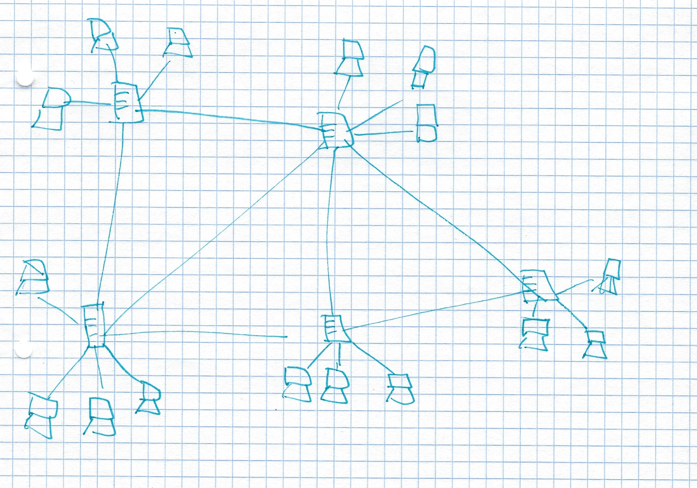

# DEZSYS_GK731_DEZENTRALE_SYSTEME

## Einfuehrung

Seit mehreren Jahren prägen dezentrale Systeme die IT Landschaft von Unternehmen und Haushalten. Die Verbreitung erfolgt oft schleichend und vielen Benutzern ist nicht bewusst, dass sie eine solches komplexes System jeden Tag mehrmals benutzen.

## Voraussetzungen

* Grundlagen Dezentrale Systeme

## Aufgabenstellung

Das Ziel dieser Aufgabenstellung ist es den Begriff dezentrale Systeme und deren Bedeutung im heutigen Alltag eines Unternehmens zu verdeutlichen. Die Teilnehmer des Kurses sollen Recherche zu den vorgetragenen Begriffe durchführen und diese nochmals zusammenfassen.

Weiters soll ein Konzept ausgearbeitet werden, um ein dezentrales System in einer sehr vereinfachten Problemstellung einzusetzen. Hier muss zuerst ein passendes Middleware System gefunden werden und dann sollen die einzelnen Umsetzungsschritte beschrieben werden.

**Problemstellung:**

Zwei Produktionsbetriebe (Mitarbeiteranzahl 50-100 Personen) verwenden jeweils eine eigene Software um Rechnungen/Angebote/Mahnungen zu verwalten. Das Risiko die Rechnungssystem umzustellen wird als zu hoch bewertet, daher wir entschieden, dass ein System benoetigt wird, dass dem jeweils anderen Standort die Suche nach bestimmten Kriterien (Rechnung/Angebot/Mahnung/Kunde) ermöglicht. Sie werden als System Architekt herangezogen, um eine entsprechende "verteilte" Lösung zu konzipieren.

## Aufgabenstellung

Bei der Suche nach den Begriffen & Definitionen vergessen Sie bitte nicht die Quellenangaben anzufuehren.

* Finde eine weitere Definition von "Verteilte Systeme"

Beschreibe die folgenden Begriffe UND formuliere mit eigenen Worten ein Beispiel dazu:

* Skalierbarkeit
* Offenheit
* Transparenz
* Interoperabilitaet
* Portabilitaet
* Replikation
* Migration
* Beschreibung Fehlermodelle Ich
* Lose gekoppelte Systeme
* Service orientierte Architektur
* Nachrichten orientierte Architektur Ich
* Enterprise Architecture Integration
* Dokumente und Links
* Cluster
* Gridsysteme
* Cloudsysteme

## Bewertung

Gruppengroesse: 1 Person

### Anforderungen "ueberwiegend erfuellt"

* Definition & Beschreibung der Begriffe
* Grobentwurf/Skizze zur Einführung eines dezentralen Systems zum Austausch von Rechnungsinformationen
* Beschreibung von Gefahren & Risiken des neuen Systems

### Anforderungen "zur Gaenze erfüllt"

* Feinentwurf des Konzepts
* Beschreibung der einzelnen Meilensteine
* Marktübersicht: Welche Systeme/Produkte sind dafür geeignet?
* Entscheidung & Begründung für ein System/Produkt

## Begriffe:

#### Verteilte Systeme:
Ein Verteiltes System ist eine Menge voneinander unabhängiger Computer, die dem Benutzer wie ein einzelnes, kohärentes System erscheinen

Quelle:
https://vowi.fsinf.at/wiki/TU_Wien:Verteilte_Systeme_VO_(G%C3%B6schka)/Fragenkatalog_Wiki
#### Skalierbarkeit:
Drei Unterschiedliche Dimensionen(Neumann,1994):

1. Skalierbar in Hinblick auf die Größße das bedeutet, dass man ganz einfach neue Benutzer und Ressourcen hinzugefügt werden können.
2. Ein System geografisch skalierbar wenn die Benutzer und die Ressourcen weit auseinander liegen
3. Ein System ist adminstrativ skalierbar, also auch noch einfach zu verwalten wenn es sich über viele unabhängige adminstrativ Organisationen erstreckt.

Beispiel:
Zum Beispiel wenn ein Server in den USA steht bedeutet Skalierbar das es keine Rolle spielt ob der Benutzer weit entfernt ist oder nicht.

#### Offenheit:
Ein offenes verteiltes System bietet Dienste nach Stansdardregeln an die die Syntax und die Semantik dieser Dienste beschreiben.

Beispiel:
Die Standardregeln steuern beispielsweise in einem Computernetzwerk die Bedeutung des Inhalts und das Format gesendeter und empfangener Nachrichten.

#### Transparenz:

Eines der wichtigs Ziel ist es zuverbergen, dass ihre Prozesse und Ressourcen physisch über mehrere Computer verteilt sind. Ein verteiltes System, das in der Lage ist, sich Benutzern und Anwendungen so darzustellen, als sei es nur ein einziges Computersystem, wird als transparent bezeichenet.

Beispiel: Zum Beispiel wenn ein User sich im Web bewegt und der Meinung ist, dass er wenn er auf eine bestimmte Seite geht und sich dort beweget immer auf einem Server ist.

#### Interoperabilitaet

Die Interoperabilitaet beschreibt den Grad bis zu dem zwei Implementierungen von Systemen oder Komponenten nebeneinader arbeiten können wobei der Hersteller keine Rolle spielen sollte

Beispiel: In einem Netzwerk sollte sowohl Linux-System, Windows-Systeme als auch Mac-OS-System funktionieren.

#### Portabilitaet

Beschreibt in welchem Ausmaß eine Anwendung  die auf dem System A läuft auf dem einem anderen System B läuft ohne etwas zu ändern.

Beispiel: Tox

#### Replikation

Bei der Aktualisierung muss eine Kopie erstellt werden und die anderen Kopien ebenfalls aktualisiert werden müssen. Da die Replikate dann nicht mehr identisch sind.

Beispiel: Der allgemeine Aufbau eines logischen Datenspeichers, physisch verteilt  und repliziert für mehrere Prozesse
####  Migration
Migration ist eine Art von Transparenz und verhindert, dass eine relevate Ressource verschoben werden kann.

Beispiel: Die selbe Ressource auf unterschiedlichen Servern ohne das Benutzer es weiß.
####  Beschreibung Fehlermodelle
Fehler werden in Klassen eingeteil damit man die Auswirkung einschätzen kann.

Bsp: crash failure: Ein server stürtzt ab und gibt keine Rückmeldungen mehr.

####  Lose gekoppelte Systeme
Lose gekoppelt bedeutet, dass die Software und Hardware nur sehr gering voneinander abhängen.

Bsp: Bei einer großen Berechnung wenn die Berechnung aufgeteilt wird und die einzelnen Ergebnise an den Hauptrechner gesendet werden.

Quelle: (Wikipedia)
####  Service orientierte Architektur
Serviceorientierte Architektur dient dazu Dienste von IT-Systemen zu strukturieren und zu nutzen. Eine besondere Rolle spielt dabei die Orientierung an Geschäftsprozessen, was so viel bedeute, das bestimmte Abfragen eine höhere Priorität haben.

Bsp: Banksysteme

Quelle: (Wikipedia)
####  Nachrichten orientierte Architektur
Nachrichtenorientierte Middleware ist eine asynchronen oder synchronen Kommunikation. Bei der wird oft kein Format festgelegt aber meistens wird XML verwendet.

Bsp: SAP Process Integration
####  Enterprise Architecture Integration
Moderne Unternehmen basieren auf komplexen Geschäftssystemen, die von IT-Systemen unterstützt werden. Diese integrieren mehrere Technologien und Standards. Die Modellierung dient dazu die Architektur des Unternehmens zu erfassen, zu kommunizieren und zu verbessern.

Bsp: SAP
####  Dokumente und Links
Ein Dokument ist etwas handschriftliches oder digitales geschrieben und etwas mitzuteilen.
Ein Link verweist auf etwas.

####  Cluster
Ein Cluster besteht aus mehrere vernetzten Rechner. Die zur Ressourcenaufteilung und Verfügbarkeit dienen.

Beispiel: Facebook
####  Gridsysteme
Grids sind Clustern die lose gekoppelt sind. Sie sind dazu da rechenintensive Probleme zu lösen.

Bsp: Webdienste
####  Cloudsysteme
Ist eine Speicher im Internet auf den mehrere Leute Zugriffen haben. Dient zum Austausch von Daten.

Beispiel: Google Drive

#### Grobentwurf/Skizze zur Einführung eines dezentralen Systems zum Austausch von Rechnungsinformationen

#### Gefahren und Risiken:
* Ausfall des Netzwerks
* Übersprechen
* Ausfall eines Servers
* Ressource gehen verloren
* Hauptserver Rolle geht verloren
* Wenn ein Server ausfällt ist ein ganzer Netzwerkabschnitt offline
* Inkonsistenz
* Syncronisation
* Timeouts

#### Quelle:

Quelle: (Verteilte Systeme Buch) Autor (Andrew S. Tanenbaum, Maarten van Steen)
https://www.nomagic.com/getting-started/solutions/enterprise-architecture
https://de.wikipedia.org/wiki/Cloud_Computing
https://de.wikipedia.org/wiki/Lose_Kopplung
https://de.wikipedia.org/wiki/Message_Oriented_Middleware
https://www.nomagic.com/getting-started/solutions/enterprise-architecture
https://vowi.fsinf.at/wiki/TU_Wien:Verteilte_Systeme_VO_(G%C3%B6schka)/Fragenkatalog_Wiki
